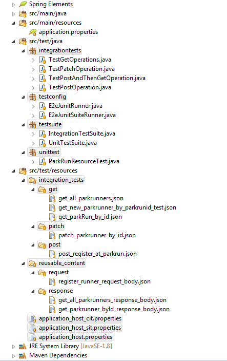
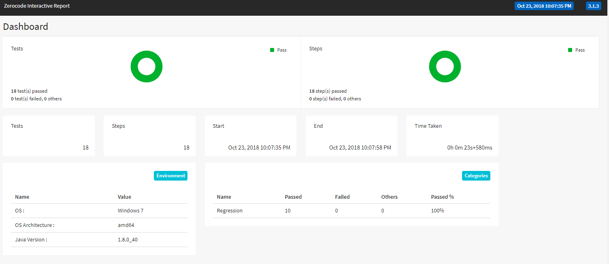
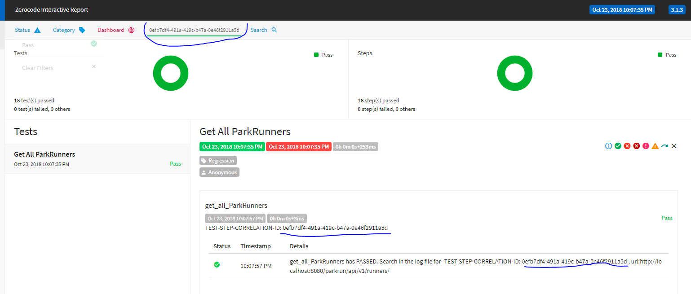

SonarQube Scanner for Maven
====

[](https://travis-ci.com/BeTheCodeWithYou/SpringBoot-ZeroCode-Integration)


# Spring-boot, Spring-Data, H2 In-Memory DB application - Integration-testing
This demo project exaplins how [JUnit](https://github.com/junit-team/junit4) and [Zerocode](https://github.com/authorjapps/zerocode) test framework based integration-tests for a "spring-boot, spring-data and H2 in-memory DB" application can make your life easy everyday.

> Keep it simple and easy while doing the integration tests

##### Needed maven dependencies
```xml
<dependency>
    <groupId>org.jsmart</groupId>
    <artifactId>zerocode-rest-bdd</artifactId>
    <version>1.2.x</version> 
</dependency>
```



### Where are the integration tests?
+ The JUnit integration tests are located under-
  + test/java/integrationtests/crudtests
 
You can run and debug them individually.
Running test individually
> mvn -Dtest=<Test Classs Name> test
e.g. > mvn -Dtest=TestGetOperations test

### Where is the Suite to run all the tests?
The suite JUnit suite test located-
+ `src/test/java/integrationtests/IntegrationTestSuite.java`
Running the test Suite
e.g. 
> mvn -Dtest=IntegrationTestSuite test

### How do they integration tests run in the maven life cycle?
e.g.
> mvn clean install sonar:sonar -Dsonar.skip=true    ( skip sonar if your project is not setup on Sonar. Follow [here](https://extremeportal.blogspot.com/2018/11/sonarcloud-integration-with-springboot.html), if you like to setup local project on SonarCloud )

+ The integration-tests are fired in the `<goal>integration-test</goal>` as configured in the `pom.xml`

```     
  <plugin>
      <groupId>org.apache.maven.plugins</groupId>
      <artifactId>maven-failsafe-plugin</artifactId>
      <executions>
          <execution>
              <goals>
                  <goal>integration-test</goal>
                  <goal>verify</goal>
                  <configuration>
                    <includes>
                      <include>testsuite.IntegrationTestSuite.java</include>
                      <include>testsuite.UnitTestSuite.java</include>
                    </includes>
                 </configuration>
              </goals>
          </execution>
      </executions>
  </plugin>
```     

+ Please look at the the Suite-Test class `<include>integrationtests.IntegrationTestSuite.java</include>` which is pointing 
to the root of the tests in the test-resources folder `resource/integration_tests`

i.e. as below-
```
@EnvProperty("_${env}")
@TargetEnv("application_host.properties")
@TestPackageRoot("integration_tests")  //You can point this to any package you need -or- use Junit Suite runner to point to individual test classes
@RunWith(E2eJunitSuiteRunner.class)
public class IntegrationTestSuite {

}
```
### What does the above @EnvProperty("_${env}") do?
Allow you to run your same testsuite against multiple environments, just by simply mentioning env name. 
Passing environment param via Jenkins and dynamically picking environment specific properties file in CI.

/**
 Set "env=cit" in Jenkins then the runner picks "application_host_cit.properties" and runs.
 if -Denv=sit, then runner looks for and picks "application_host_sit.properties" and runs.

If `env` not supplied, then defaults to "application_host.properties" which by default mentioned mentioned via @TargetEnv
 
 -or-
 
 Configure the below `mvn goal` when you run via Jenkins goal in the specific environment e.g. -
 
 For CI :
 mvn clean install -Denv=ci 
 
 For SIT:
 mvn clean install -Denv=sit
 
 and make sure:
 application_host_cit.properties and application_host_sit.properties etc are available in the resources folder or class path.
 */

## How to verify @EnvProperty("_${env}") test on Local?

Run 2 instances of application JAR on differnt ports

> java -jar -Dserver.port=9090 SpringbootRestInMemoryDB-1.0.0-SNAPSHOT.jar

> java -jar -Dserver.port=7070 SpringbootRestInMemoryDB-1.0.0-SNAPSHOT.jar

Running IntegrationTestSuite against environment profile

> mvn -Denv=cit -Dtest=IntegrationTestSuite test

( runs test against application_host_cit.properties. Verify logs from JAR running on 9090 port.)

> mvn -Denv=sit -Dtest=IntegrationTestSuite test

( runs test against application_host_sit.properties. Verify logs from JAR running on 7070 port.)

> mvn -Dtest=IntegrationTestSuite test

( runs test against application_host.properties which runs on default port 8080.)

### what does the above @TargetEnv("application_host.properties") do?
Sets the target environment for your tests to run aginst.

### What does the above @RunWith do?
> @RunWith(E2eJunitSuiteRunner.class)

Ans: It starts the spring applications and then fires the tests once by one.
See below how it brings up the application.
```
public class E2eJunitSuiteRunner extends ZeroCodePackageRunner {

    static{
        Application.start();
    }

    public E2eJunitSuiteRunner(Class<?> klass) throws InitializationError {
        super(klass);
    }
}
```

### Viewing Reports
Find detailed TEST Reports (zerocode-junit-interactive-fuzzy-search.html) and logs genrated under /target folder

> Test Summary report


> Test detailed execution report


> Trace API test result from CORRELATION-ID driectly from report UI


> Trace API request/response as part of TEST execution using CORRELATION-ID from log file zerocode_rest_bdd_logs.log generated under target\logs folder.

### Zerodefect API build pipeline approach
Refer to steps 1 to 10 on my article, to follow preferred build pipeline approach to get BEST out of ZeroCode and TDD combination!

https://medium.com/@bethecodewithyou/develop-zerodefect-apis-with-zerocode-cadd9dc2a430
OR at  https://extremeportal.blogspot.com/2018/10/develop-zerodefect-apis-with-zerocode.html


[How do I do integration testing of a spring boot application]: https://github.com/authorjapps/spring-boot-integration-test#spring-boot-integration-test
[How to do integration testing of a spring boot application]: https://github.com/authorjapps/spring-boot-integration-test#spring-boot-integration-test
[Integration testing of a spring boot application]: https://github.com/authorjapps/spring-boot-integration-test#spring-boot-integration-test
[Zerocode testing of a spring boot application]: https://github.com/authorjapps/spring-boot-integration-test#spring-boot-integration-test
[Zerocode JSON testing of a spring boot application]: https://github.com/authorjapps/spring-boot-integration-test#spring-boot-integration-test
[Zerocode testing of a spring application]: https://github.com/authorjapps/spring-boot-integration-test#spring-boot-integration-test
